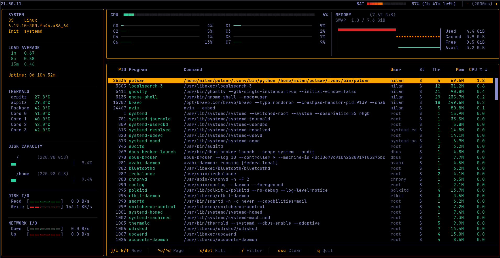

# Pulsar

A terminal system monitor for Linux built with Python, Textual, and psutil.



## Features

- Real-time CPU (per-core), memory, disk I/O, network I/O, thermals, and load average
- Process table with sort (CPU, memory, PID, user), filter by name/command/PID, and kill
- Custom Line API renderer replacing Textual's `DataTable` — scroll cost is O(1) regardless of process count, via per-row `Strip` caching
- Multiple custom themes: Batman, Cyberpunk, Hacker, Monochrome, plus most built-in Textual themes

## Installation

**In a virtual environment (recommended):**
```bash
git clone https://github.com/mnprtstle/pulsar.git
cd pulsar
python3 -m venv .venv
source .venv/bin/activate
pip install -e .
```

**Globally:**
```bash
git clone https://github.com/mnprtstle/pulsar.git
cd pulsar
pip install -e . --break-system-packages
```

## Usage

```bash
pulsar
```

## Architecture

Pulsar runs two threads for its lifetime:

**Background thread** — a single persistent thread that loops on a configurable interval. Each tick calls psutil to collect all system and process metrics, computes diffs against the previous tick to detect what changed, and constructs Rich `Text` objects and Textual `Strip` renderables ready for display. Only changed rows get their `Strip` rebuilt. Once a tick is complete, results are pushed to the main thread via `call_from_thread`.

**Main thread** — Textual's event loop. Its only job is to receive the pre-built renderables from the background thread and call `widget.update()` or swap references in the process table's strip cache. It also handles all user input (scroll, sort, filter, kill) directly, operating on the cached data already in memory — sort and filter never trigger a psutil rescan.

This separation keeps the main thread free from any blocking or compute-heavy work, which is what allows the TUI to remain responsive during metric updates. Background threads never touch live Textual widget state directly (unless the state is a primitive data type that is thread safe under GIL) — anything they need (theme colors, layout widths, scroll position) is snapshotted on the main thread and passed in as a plain value before the worker starts.

The process table uses Textual's Line API (`render_line(y) -> Strip`) rather than the built-in `DataTable`. `DataTable` re-runs Rich's layout pipeline for every visible cell on every scroll frame regardless of whether data changed. The Line API replacement keeps a `pid -> Strip` cache: `render_line` as a dict lookup for unchanged rows, and `Strip` rebuilds only happen in the background thread for rows whose raw metric tuple actually changed since the last tick.

## Performance

Tested on a Core i5-8250U laptop running Fedora Workstation in balanced power mode:

| Metric | Value |
|---|---|
| Memory usage | ~80 MB |
| Idle CPU | ~1.5% |
| CPU while scrolling | ~6% |

Scrolling performance was benchmarked against [Toolong](https://github.com/Textualize/toolong) — a log viewer built by Textual's author using the same Line API — under equivalent content complexity. Pulsar lands in the same range, confirming the remaining cost is framework/compositor-level rather than application code. A hand-rolled ANSI renderer (like btop or bpytop) would be faster, but that trades away Textual's composable widget model, reactive theming, and the clean separation between rendering and data that makes this architecture maintainable.

## Known Limitations

- Transparency is not supported — Textual emits explicit 24-bit RGB background colors for every cell by design, which precludes terminal alpha blending
- Primarily tested on Fedora Linux; macOS support is partial (thermals and load average may differ)
- No Windows support
